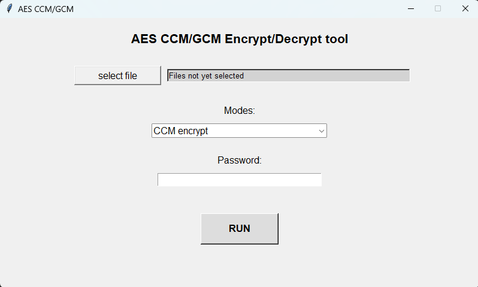
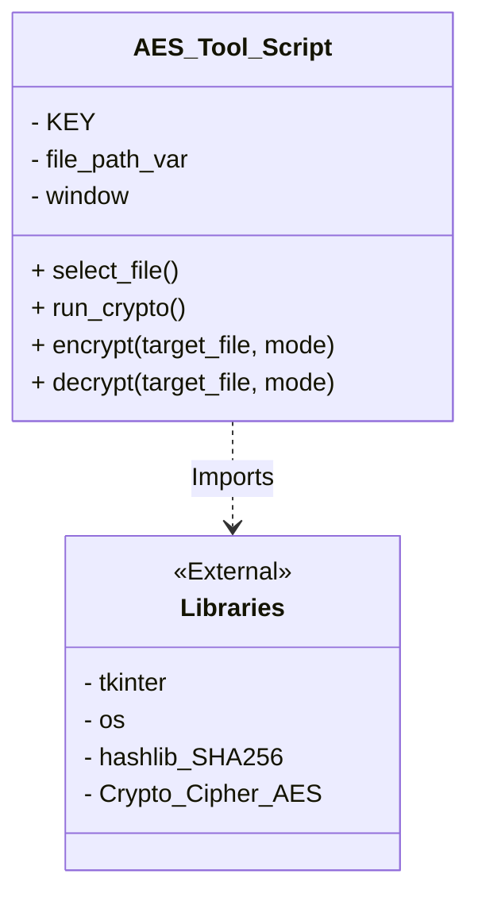
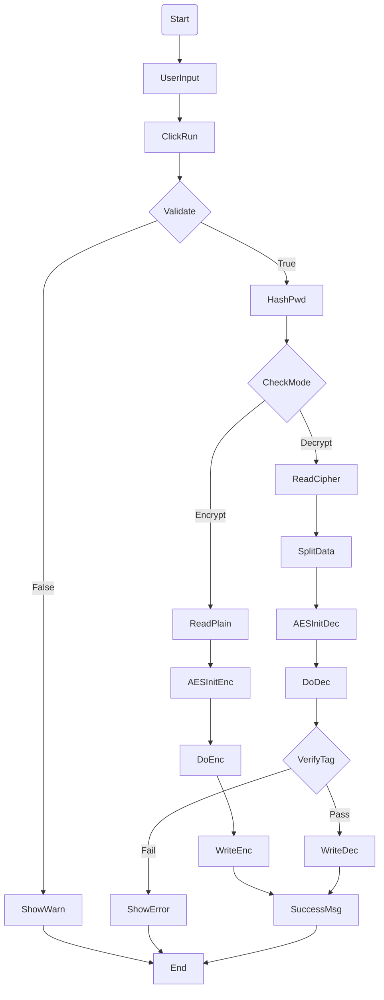
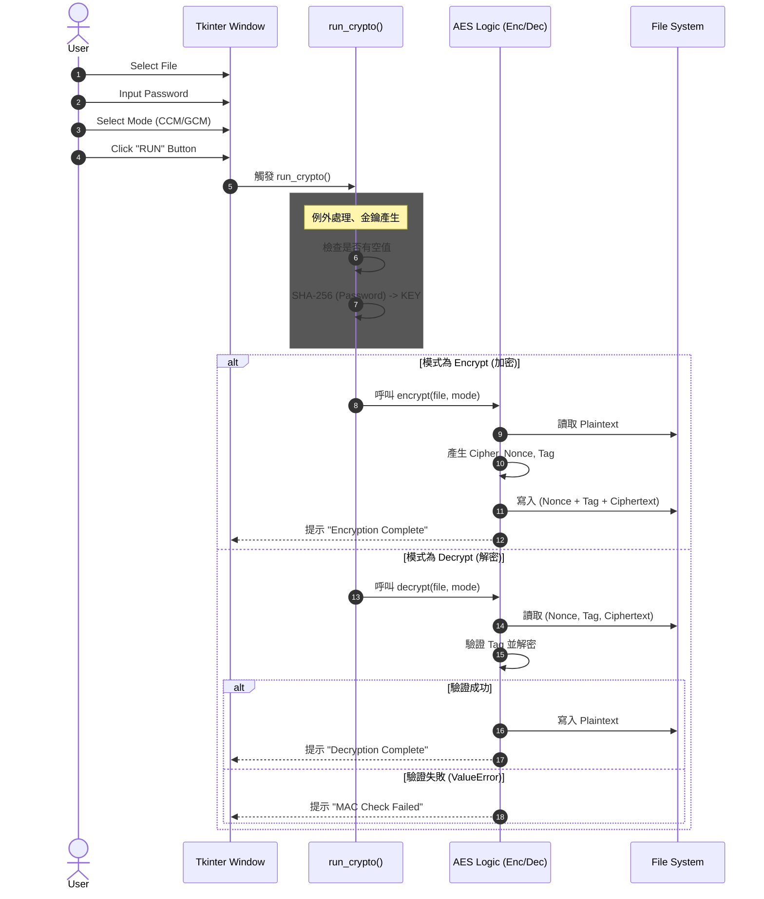

# 114-1-Information-Security-Final_Project

## 程式結構

```mermaid
classDiagram
    direction TB
    
    class AES_Tool_Script
    AES_Tool_Script : - KEY
    AES_Tool_Script : - file_path_var
    AES_Tool_Script : - window
    AES_Tool_Script : + select_file()
    AES_Tool_Script : + run_crypto()
    AES_Tool_Script : + encrypt(target_file, mode)
    AES_Tool_Script : + decrypt(target_file, mode)

    class Libraries
    <<External>> Libraries
    Libraries : - tkinter
    Libraries : - os
    Libraries : - hashlib_SHA256
    Libraries : - Crypto_Cipher_AES

    
    AES_Tool_Script ..> Libraries : Imports
```
## 執行流程

```mermaid
graph TD
    Start(Start) --> UserInput
    UserInput --> ClickRun
    ClickRun --> Validate{Validate} 
    
    Validate -- False --> ShowWarn
    ShowWarn --> End
    
    Validate -- True --> HashPwd
    HashPwd --> CheckMode{CheckMode}
    
    %% 加密流程
    CheckMode -- Encrypt --> ReadPlain
    ReadPlain --> AESInitEnc
    AESInitEnc --> DoEnc
    DoEnc --> WriteEnc
    WriteEnc --> SuccessMsg
    
    %% 解密流程
    CheckMode -- Decrypt --> ReadCipher
    ReadCipher --> SplitData
    SplitData --> AESInitDec
    AESInitDec --> DoDec
    
    DoDec --> VerifyTag{VerifyTag}
    VerifyTag -- Fail --> ShowError
    VerifyTag -- Pass --> WriteDec
    WriteDec --> SuccessMsg
    
    ShowError --> End
    SuccessMsg --> End
```
## Sequence Diagram

```mermaid
sequenceDiagram
    autonumber
    actor User
    participant GUI as Tkinter Window
    participant Main as run_crypto()
    participant AES as AES Logic (Enc/Dec)
    participant FS as File System

    User->>GUI: Select File
    User->>GUI: Input Password
    User->>GUI: Select Mode (CCM/GCM)
    User->>GUI: Click "RUN" Button

    GUI->>Main: 觸發 run_crypto()
    
    rect rgba(87, 87, 87, 1)
        Note over Main: 例外處理、金鑰產生
        Main->>Main: 檢查是否有空值
        Main->>Main: SHA-256 (Password) -> KEY
    end

    alt 模式為 Encrypt (加密)
        Main->>AES: 呼叫 encrypt(file, mode)
        AES->>FS: 讀取 Plaintext
        AES->>AES: 產生 Cipher, Nonce, Tag
        AES->>FS: 寫入 (Nonce + Tag + Ciphertext)
        AES-->>GUI: 提示 "Encryption Complete"
        
    else 模式為 Decrypt (解密)
        Main->>AES: 呼叫 decrypt(file, mode)
        AES->>FS: 讀取 (Nonce, Tag, Ciphertext)
        AES->>AES: 驗證 Tag 並解密
        
        alt 驗證成功
            AES->>FS: 寫入 Plaintext
            AES-->>GUI: 提示 "Decryption Complete"
        else 驗證失敗 (ValueError)
            AES-->>GUI: 提示 "MAC Check Failed"
        end
    end
```