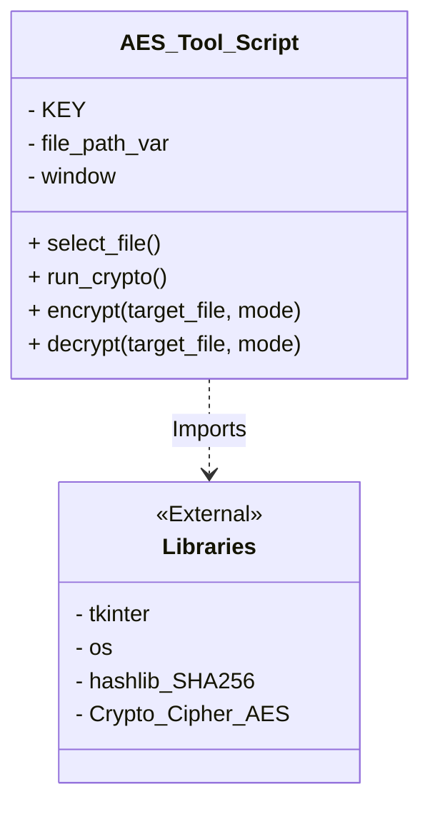
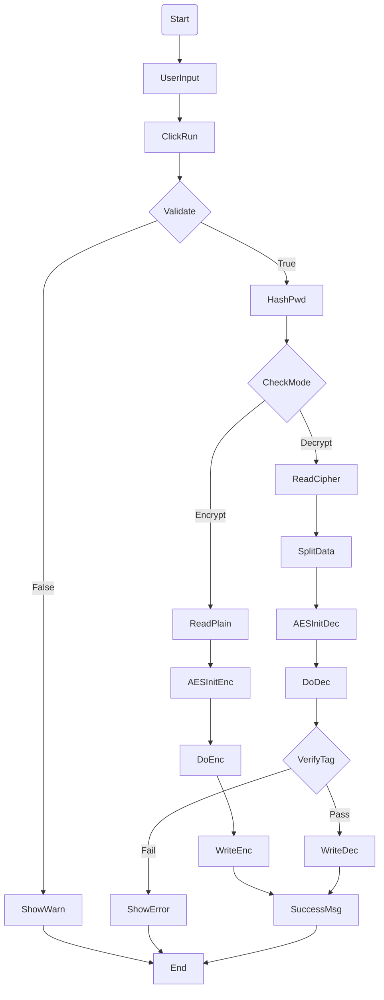

# 114-1-Information-Security-Final_Project

## 程式結構

```mermaid
classDiagram
    direction TB
    
    class AES_Tool_Script
    AES_Tool_Script : - KEY
    AES_Tool_Script : - file_path_var
    AES_Tool_Script : - window
    AES_Tool_Script : + select_file()
    AES_Tool_Script : + run_crypto()
    AES_Tool_Script : + encrypt(target_file, mode)
    AES_Tool_Script : + decrypt(target_file, mode)

    class Libraries
    <<External>> Libraries
    Libraries : - tkinter
    Libraries : - os
    Libraries : - hashlib_SHA256
    Libraries : - Crypto_Cipher_AES

    
    AES_Tool_Script ..> Libraries : Imports
```
## 執行流程

```mermaid
graph TD
    Start(Start) --> UserInput
    UserInput --> ClickRun
    ClickRun --> Validate{Validate} 
    
    Validate -- False --> ShowWarn
    ShowWarn --> End
    
    Validate -- True --> HashPwd
    HashPwd --> CheckMode{CheckMode}
    
    %% 加密流程
    CheckMode -- Encrypt --> ReadPlain
    ReadPlain --> AESInitEnc
    AESInitEnc --> DoEnc
    DoEnc --> WriteEnc
    WriteEnc --> SuccessMsg
    
    %% 解密流程
    CheckMode -- Decrypt --> ReadCipher
    ReadCipher --> SplitData
    SplitData --> AESInitDec
    AESInitDec --> DoDec
    
    DoDec --> VerifyTag{VerifyTag}
    VerifyTag -- Fail --> ShowError
    VerifyTag -- Pass --> WriteDec
    WriteDec --> SuccessMsg
    
    ShowError --> End
    SuccessMsg --> End
```